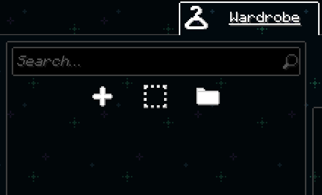

# How to Install and Use a Figura Avatar in Minecraft

Credit to **@amogusiik_** on Discord for creating this amazing avatar.

## 1. Download Figura
Go to [https://modrinth.com/mod/figura](https://modrinth.com/mod/figura) and download the version that matches your Minecraft version.

## 2. Install the Mod
Move the downloaded `.jar` file into your Minecraft `mods` folder.  
*(If the folder doesn't exist, create one inside your `.minecraft` directory.)*

## 3. Launch Minecraft
Open the game using a mod loader like **Fabric**. Then load into any world or server.

## 4. Open the Figura Menu
- Press **ESC** to pause the game.
- Click the **triangle icon** (Figura).
- Tap the **folder icon** at the top-left corner of the screen. This will open the `avatars` folder.

## 5. Download and Install the Ralsei Avatar
- [Click here to download Ralsei.zip](https://github.com/lolmam/Ralsei-Avatar-Tutorial/raw/refs/heads/main/Ralsei.zip) *(includes the latest fix)*.
- Extract the ZIP file.
- Move the **Ralsei** folder into the opened `avatars` folder.

## 6. Select Your Avatar
Return to Minecraft, and select “Ralsei Deltarune” from the left panel in the Figura menu.

## 7. You're All Set!
Your custom Ralsei avatar should now appear in-game. Enjoy!
